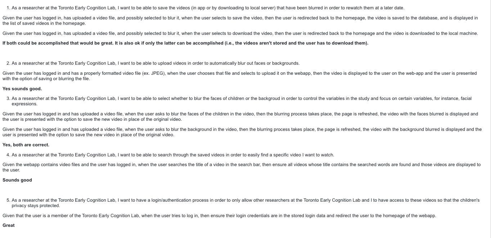
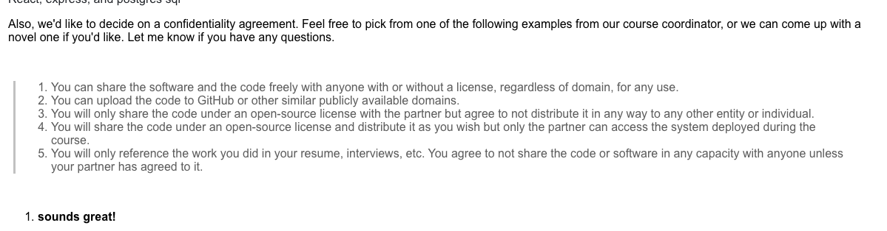

# University of Toronto / MBELKS
> _Note:_ This document is meant to evolve throughout the planning phase of your project.   That is, it makes sense for you commit regularly to this file while working on the project (especially edits/additions/deletions to the _Highlights_ section). Most importantly, it is a reflection of all the planning you work you've done in the first iteration.
 > **This document will serve as a master plan between your team, your partner and your TA.**

## Product Details

#### Q1: What are you planning to build?

We are planning to build a web-app that enables U of T Researchers to analyze videos of children while ignoring either the background of the video, or the face of the child. This allows viewers of videos to analyze the situation in the background of the video without being affected by the child, or to analyze the emotions and reactions of the child without knowledge of the background situation. It also anonymizes children, if our users wish to publish the videos to support research. The web-app will be similar to a file library where the user can upload, store, and watch the videos from the studies with the added feature of blurring the component the user wants blurred (faces/ background).

 > Short (1 - 2 min' read)
 * Start with a single sentence, high-level description of the product.
 * Be clear - Describe the problem you are solving in simple terms.
 * Be concrete. For example:
    * What are you planning to build? Is it a website, mobile app,
   browser extension, command-line app, etc.?
    * When describing the problem/need, give concrete examples of common use cases.
    * Assume your the reader knows nothing about the problem domain and provide the necessary context.
 * Focus on *what* your product does, and avoid discussing *how* you're going to implement it.
   For example: This is not the time or the place to talk about which programming language and/or framework you are planning to use.
 * **Feel free (and very much encouraged) to include useful diagrams, mock-ups and/or links**.


#### Q2: Who are your target users?

Our target users are Researchers at the University of Toronto who are within the Toronto Early Cognition Lab, and who wish to upload and/or view recordings from earlier dates. The scope of this may eventually creep beyond the TECL to other labs such as the Child Development Lab, but will most likely remain U of T centric software.


  > Short (1 - 2 min' read max)
 * Be specific (e.g. a 'a third-year university student studying Computer Science' and not 'a student')
 * **Feel free to use personas. You can create your personas as part of this Markdown file, or add a link to an external site (for example, [Xtensio](https://xtensio.com/user-persona/)).**

#### Q3: Why would your users choose your product? What are they using today to solve their problem/need?

By using our product the researchers at the University of Toronto Early Cognition Lab would be able to save time as they would be able to quickly upload a video and could choose to automatically blur either the background or the face of the people in the videos. They would be able to save the results into a database on the same web application where they can quickly find any previously uploaded and processed videos that they may want to use. Currently as the researchers aren’t using anything to solve their current problem, they would have to manually blur the faces or backgrounds of their videos using third party applications and then download and reupload the video file to a separate database which is a process that our product streamlines and condenses into one web application. This is either very tedious or outside their technical expertise.

> Short (1 - 2 min' read max)
 * We want you to "connect the dots" for us - Why does your product (as described in your answer to Q1) fits the needs of your users (as described in your answer to Q2)?
 * Explain the benefits of your product explicitly & clearly. For example:
    * Save users time (how much?)
    * Allow users to discover new information (which information? And, why couldn't they discover it before?)
    * Provide users with more accurate and/or informative data (what kind of data? Why is it useful to them?)
    * Does this application exist in another form? If so, how does your differ and provide value to the users?
    * How does this align with your partner's organization's values/mission/mandate?

#### Q4: How will you build it?

**Frontend**:
React
- RTL
- Jest
- Node
- Webpack
- ESLint
- Prettier
- Typescript

**Backend**:

**Third Parties**:
- AWS
- Docker

We are currently using Webpack to serve the application. For deployment this application can then be packaged into a Docker container and served on local servers. The videos will be stored offline on an AWS S3 bucket. Our testing strategy for the frontend revolves around using RTL and Jest to verify components are being rendered and perform the correct functions on stimulus. We aim to keep detailed debug logs for easy troubleshooting.

**Architecture**:


> Short (1-2 min' read max)
 * What is the technology stack? Specify any and all languages, frameworks, libraries, PaaS products or tools.
 * How will you deploy the application?
 * Describe the architecture - what are the high level components or patterns you will use? Diagrams are useful here.
 * Will you be using third party applications or APIs? If so, what are they?
 * What is your testing strategy?

#### Q5: What are the user stories that make up the MVP?

1. As a researcher at the Toronto Early Cognition Lab, I want to be able to save the videos (in app or by downloading to local server) that have been blurred in order to rewatch them at a later date.

Given the user has logged in, has uploaded a video file, and possibly selected to blur it, when the user selects to save the video, then the user is redirected back to the homepage, the video is saved to the database, and is displayed in the list of saved videos in the homepage.

Given the user has logged in, has uploaded a video file, and possibly selected to blur it, when the user selects to download the video, then the user is redirected back to the homepage and the video is downloaded to the local machine.


2. As a researcher at the Toronto Early Cognition Lab, I want to be able to upload videos in order to automatically blur out faces or backgrounds.

Given the user has logged in and has a properly formatted video file (ex. JPEG), when the user chooses that file and selects to upload it on the webapp, then the video is displayed to the user on the web-app and the user is presented with the option of saving or blurring the file.


3. As a researcher at the Toronto Early Cognition Lab, I want to be able to select whether to blur the faces of children or the backgroud in order to control the variables in the study and focus on certain variables, for instance, facial expressions.

Given the user has logged in and has uploaded a video file, when the user asks to blur the faces of the children in the video, then the blurring process takes place, the page is refreshed, the video with the faces blurred is displayed and the user is presented with the option to save the new video in place of the original video.

Given the user has logged in and has uploaded a video file, when the user asks to blur the background in the video, then the blurring process takes place, the page is refreshed, the video with the background blurred is displayed and the user is presented with the option to save the new video in place of the original video.


4. As a researcher at the Toronto Early Cognition Lab, I want to be able to search through the saved videos in order to easily find a specific video I want to watch.

Given the webapp contains video files and the user has logged in, when the user searches the title of a video in the search bar, then ensure all videos whose title contains the searched words are found and those videos are displayed to the user.

5. As a researcher at the Toronto Early Cognition Lab, I want to have a login/authentication process in order to only allow other researchers at the Toronto Early Cognition Lab and I to have access to these videos so that the children's privacy stays protected.

Given that the user is a memeber of the Toronto Early Cognition Lab, when the user tries to log in, then ensure their login credentials are in the stored login data and redirect the user to the homepage of the webapp.



 * At least 5 user stories concerning the main features of the application - note that this can broken down further
 * You must follow proper user story format (as taught in lecture) ```As a <user of the app>, I want to <do something in the app> in order to <accomplish some goal>```
 * User stories must contain acceptance criteria. Examples of user stories with different formats can be found here: https://www.justinmind.com/blog/user-story-examples/. **It is important that you provide a link to an artifact containing your user stories**.
 * If you have a partner, these must be reviewed and accepted by them. You need to include the evidence of partner approval (e.g., screenshot from email) or at least communication to the partner (e.g., email you sent)

----
## Intellectual Property Confidentiality Agreement

We have agreed with the partners to option 1: we can share the software and the code freely with anyone with or without a license, regardless of domain, for any use.



> Note this section is **not marked** but must be completed briefly if you have a partner. If you have any questions, please ask on Piazza.
>
**By default, you own any work that you do as part of your coursework.** However, some partners may want you to keep the project confidential after the course is complete. As part of your first deliverable, you should discuss and agree upon an option with your partner. Examples include:
1. You can share the software and the code freely with anyone with or without a license, regardless of domain, for any use.
2. You can upload the code to GitHub or other similar publicly available domains.
3. You will only share the code under an open-source license with the partner but agree to not distribute it in any way to any other entity or individual.
4. You will share the code under an open-source license and distribute it as you wish but only the partner can access the system deployed during the course.
5. You will only reference the work you did in your resume, interviews, etc. You agree to not share the code or software in any capacity with anyone unless your partner has agreed to it.

**Briefly describe which option you have agreed to. Your partner cannot ask you to sign any legally binding agreements or documents pertaining to non-disclosure, confidentiality, IP ownership, etc.**

----

## Process Details

#### Q6: What are the roles & responsibilities on the team?

**Lorena Buciu:** Scrum Master / Fullstack Dev
- Will lead our progress meetings and identify any blockers that other team members may have and ensure our kanban board is accurately reflecting this. Determine ways to prevent backlogs/distractions
- Will add details to new tasks to ensure that instructions are clear for team members
- Will work on tasks in both the backend and frontend components of the application

**Strengths**:
- Agile
- JavaScript
- Vue.js

**Weaknesses**:
- Node.js
- Express.js
- Prisma

**Emily Chang:** Fullstack Dev
- Will work on tasks in both the backend and frontend components of the application
- Will help plan how to create the components

**Strengths**
- Agile
- Vue.js
- Sql

**Weaknesses**
- Node.js
- Express.js
- React

**Kenneth Miura** Team Lead / Fullstack Dev
- Will organize all meetings & facilitate meetings that are not lead by Scrum master.
- Be aware of all components of project, serve to facilitate communication as needed for tickets
- Work on tasks in both backend & frontend components

**Strengths**
- Agile
- SQL
- Javascript

**Weaknesses**
- Node.js
- Express.js
- Prisma

**Siddarth Dagar** Fullstack Dev
- Focus on the frontend, but will be available to help with the backend
- Manage the third party applications used
- Use Webpack to serve the application

**Strengths**
- React/TS
- AWS/Docker
- Node,js

**Weaknesses**
- Design Patterns
- Express.js
- Prisma

**Michelle Chernyi** Fullstack Dev
- Will work on tasks that have a frontend and backend component
- will work with APIs
- Person of contact for our partners


**Strengths**
- SQL
- AWS
- javascript

**Weaknesses**
- React
- Express.js
- Node.js

**Jason You:** Product Manager / Fullstack Dev
- Will guide the team to ensure that the developmental team is following the product owner's product vision
- Will create a product roadmap with the scrum master to plan and create deadlines for the devopment of the product
- Will work on tasks in both the backend and frontend components of the application

**Strengths**:
- Bootstrap
- JavaScript
- PostgreSQL

**Weaknesses**:
- React
- Express.js
- AWS

Describe the different roles on the team and the responsibilities associated with each role.
 * Roles should reflect the structure of your team and be appropriate for your project. Not necessarily one role to one team member.
 * Add role(s) to your Team-[Team_Number]-[Team_Name].csv file on the main folder

List each team member and:
 * A description of their role(s) and responsibilities including the components they'll work on and non-software related work
 * 3 technical strengths and weaknesses each (e.g. languages, frameworks, libraries, development methodologies, etc.)


#### Q7: What operational events will you have as a team?
**Team Meetings:**

Since we plan on having sprints, each week we will have a meeting where we will plan/assign tasks as well as a sprint update meeting at the end of the week. These meetings will be completed online. This will allow us to keep up to date on our progress and help each other with any blockers we may have.

**Partner Meetings:**

In our meeting with our partner, we discussed an overview of the project. This included what was required and our reach goals. In addition to this, we also recieved guidance on what tech stack we should use. Full details on what we discussed can be found in the meeting-minutes directory under 09-26-2022.md. To continue to make sure that we are on track and meeting the specifications that our partner sets, we will meet with them every Monday to present our progress.

Describe meetings (and other events) you are planning to have.
 * When and where? Recurring or ad hoc? In-person or online?
 * What's the purpose of each meeting?
 * Other events could be coding sessions, code reviews, quick weekly sync meeting online, etc.
 * You should have at least 2 meetings with your project partner (if you have one) before D1 is due. Describe them here:
   * What did you discuss during the meetings?
   * What were the outcomes of each meeting?
   * You must keep track of meeting minutes and add them to your repo.
   * You must have a regular meeting schedule established by the second meeting.

#### Q8: What artifacts will you use to self-organize?

List/describe the artifacts you will produce in order to organize your team.

**Github Projects:**
This will be our kanban board where we will manage our tasks and their progress. Tasks will be categorized by to-do, in progress, in review, blocked, and done. We plan on implementing a workflow to automatically update task status. For example, if an in review task PR gets merged in, then the task will move to done.
   - We will have weekly meetings with each other to discuss the next steps of our project and to determine what new tasks should be created. We will create meeting minutes for all our meetings.
   - Tasks will be prioritzed by feature importance. If a task is vital to bringing the project to MVP, this will be prioritized. Any critical bug fixes affecting usage of the platform will also be prioritized.
   - Tasks will get assigned to team members by discussion, we will distribute tasks amongst ourselves based on who is willing to do what and how comfortable they feel about the task.
   - New features will be marked as complete once they have been merged in and tested on our dev build.

 **Discord:**
 This will be our main communication platform where we can collectively organize information and communicate. We can also post announcements for everyone and get responses immediately.
 - Whenever we meet or require assistance we can join a voice chat for a call.
 - Organize relevant zoom links, google docs and meeting minutes.
 - Post ui-mockups and designs for review.
 - Conduct polls, gauge reactions and implement github webhooks.

 * Artifacts can be To-Do lists, Task boards, schedule(s), meeting minutes, etc.
 * We want to understand:
   * How do you keep track of what needs to get done?
   * **How do you prioritize tasks?**
   * How do tasks get assigned to team members?
   * How do you determine the status of work from inception to completion?

#### Q9: What are the rules regarding how your team works?

Our team's working culture is based on trust and independence. This means that people will vocalize what tasks they are comfortable with and/or would like to work on and how long they will think it should take them. If they give a reasonable timeline, follow that timeline, and provide quality work, this cycle of trust and independence will continue. If people are not meeting reasonable deadline or not providing quality work, then the team lead and/or scrum master will have to interfere.

**Communications:**
* We communicate with each other mainly through two methods our standsups and our discord channel.
   * Our stands up are expected to happen twice a week, at the beginning and end of the week
   * Communication on the discord channel does not have an expected frequency, rather it is used as needed
      * examples of this are if someone ran into an issue that cannot wait until our next stand up, if someone has a question that cannot wait until our next stand up, if someone has an annoucement to make, etc.
      * our discord group currently includes 8 channels:
         * meetings: where one of us will post a link to our standsups or our meetings with the partner
         * announcements: where a memeber will post information that is important or that will be needed later on as well
         * docs: where we can send each other any revelent documents such as our google doc for our Deliverable 1
         * to-do: one person posts a list of discussed tasks after a meeting
         * ui-mockups: where we discussed our mock-up plans, comments, and concerns
         * tech: where we send relvent links for the tech stack we are using such as a guide on react or a tutorial on AWS
         * github: in this channel an automated bot sends a message when someone makes a commit and a pull request
         * general: this channel is for any other matters, questions, issues, or concerns
* Communicating with our partner is done through our weekly online/ in person meetings and then follow up emails when necessary
   * First, every week prior to our monday meeting we send our partner a zoom link
   * In our meetings we fill them in on the previous weeks progress and our plan for the next week. They will provide us with feedback or comments on changes they want, and our scrum master will create tickets for those changes/ implementations and decide on their priority
   * Then, through out the week if we have questions about their feedback or about something we want to implement and we do not want to/ cannot wait until the next meeting, then these questions will be sent to the person of contact and they will send an email with those questions to our partner.

**Meetings:**

Our scrum master and/or team lead (dependeing on who is leading the meeting) will be our moderators. They will check that everyone showed up and finished the work they were supposed to finish by  going through the tasks in the sprint and ensuring they have all been moved from "in progress" to "under review". To hold people accountable for joining the meetings, we will choose/ be assigned tasks during the meeting, that way if someone doesn't show up, they do not get to choose a task. To hold people accountable for completing action items, the tasks will be assigned to certain sprints so people will know they have a deadline and if they do not complete it within around that deadline, our team lead will have to talk with them and ask what is going on with their task, why it is not completed, or if they need extra support.


Describe your team's working culture.

**Communications:**
 * What is the expected frequency? What methods/channels are appropriate?
 * If you have a partner project, what is your process (in detail) for communicating with your partner?

**Meetings:**
 * How are people held accountable for attending meetings, completing action items? Is there a moderator or process?


----
## Highlights

1. We made key decisions regarding the user flow for processing & uploading blurred videos. We considered the following:
   - any uploaded video be automatically processed such that we created & saved 3 videos, one with faces blurred, one with backgrounds blurred, and one unblurred. This meant the least user involvement, and was made under the assumption that researchers would want all 3 videos all the time.
   - The upload dialogue allows users to choose to blur face or background, and then preview the result. This meant users could check the results before uploading.
   Finally, we decided on a flow where an upload dialogue is opened, users can choose which blurs to apply, and then upload.
2. We chose between an ORM and directly interfacing with our database. The positives of directly interfacing with our database are performance and control. However, we decided on using an ORM because our application does not need to be that performant. Also, the major bottleneck for runtime is going to be processing the video, so performance of our database is not that important. We also are slated to have ~11 users, so our scale is low, further lessening the importance of performance. Control is not relevant for similar reasons, so we chose the more developer friendly option of an ORM.
3. We also decided between SQL and NoSQL. When considering the choice of a NoSQL DB, we considered the primary benefits, namely flexible schema and scalability. However, for our usecase, these are both not particularly relevant. Our schema is well-defined and unlikely to change, and also quite simple. Scalability is not important because our planned userbase is 11 users. Therefore, we chose to use SQL, because of it's stability & concrete schema, meaning our future development work will be simpler.


